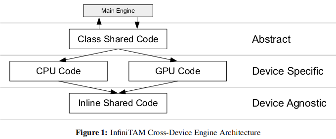

# InfiniTAMv3

## 简介：新增

- 更加稳定的跟踪模块。可以帮助①（之前就有的）深度图与场景raycast的匹配；②彩色图的匹配。
- 跟踪质量评估模块。从而可以判断是否跟踪失败
- 基于关键帧的相机重定位——随机蕨
- 基于子图（刚性）的地图，会优化子图之间的位姿
- surfel / TSDF 两种地图模式
    - surfel的优点：可以很好的处理动态场景
    - surfel的缺点：可见性与遮挡的计算更加耗时

## 程序实现结构

- 程序设计模式为[责任链模式 (Chain-of-responsibility pattern)](https://www.bilibili.com/video/BV1uk4y127hG)

- 数据结构（例如ITMImage）在多个processing engines（例如ITMTrackingEngine）之间传递

- 每个engine都是stateless，只对应流程中的一部分，结构如下图

    

    - Abstract Layer：跟main engine联系，只是包含一些抽象的接口（也可能会包含一些common code）
    - Device Specific Layer：具体实现，分CPU和GPU。也包含OpenMP或者其他加速的代码
    - Device Agnostic Layer：无关设备的实现，都是些内联的代码（C），通常由上层代码调用
    - 例如：在跟踪的engine中，Abstract Layer包含误差函数的优化，Device Specific Layer包含CPU循环或者CUDA核函数来计算图片中每个像素的误差函数，Device Agnostic Layer包含单个像素误差的验证（内联）

- stage通过object进行传递，这些object也包含了处理过的信息

- ITMMainEngine包含了所有的object并控制信息流向

- InfiniTAM v3将每个模块（即engine）放到不同的文件夹中

## 地图：哈希 + 体素

- 数据结构 && 对应操作
    - voxel block array：存储融合后的颜色、深度信息
    - hash table && hashing function：用来快速查找voxel block array
    - hash table operation：插入、查找、删除

### Voxel Block Array

- 对应的数据结构是`ITMVoxel\_[s/f]\_[/rgb/conf]`

    

- 所有固定大小、相邻的voxel block作为一组。所有的block存在连续的内存中，所以称作voxel block array（或者VBA）。论文中选取的block范围是8\*8\*8，block数量为2^18^（即2^6^\*2^6^\*2^6^，2^6^=64）

### Hash Table && Hashing Function

- hash table数组连续的数组，对应的数据结构是`ITMHashEntry`

    

- 哈希函数是`hashIndex()`，输入`blockPos`（也就是voxel block的ID坐标），输出index

    

- 为了解决hash collision（哈希冲突），哈希函数输出的index只对应orderd hash table中的一个bucket，然后用额外的unordered excess list来存储bucket中溢出来的数据。所以`ITMHashEntry`在记录index（即上面的ptr）时，还记录offset。结构如下图所示

    

### Hash Table Operation

- 查找/插入操作：

    - 根据世界坐标系 && block size找block pose（即id）
    - 在根据哈希函数找到哈希表中的index
    - 查找index对应的哈希表的bucket中所有内容
    - 如果能找到，找出所需block对应的数据 或者 插入所需数据
    - 如果找不到，则根据bucket中最后一个元素的offset去unordered excess list找，类似指针链表一个个往后找；发现offset≤-1，则停止检索

    > 注意：哈希表unordered部分 && voxel block array 中的查找操作都用到了prepopulated allocation lists，而且CUDA版本用了atomic operation

## 详细介绍

- ITMMainEngine是整个pipeline的入口，pipeline的主要部分是ProcessFrame
- pipeline有2种：ITMBasicEngine（InfiniTAMv2的）、ITMMultiEngine（InfiniTAMv3的）
- 总共包含6大模块，如下
    - tracking：通过当前帧（depth，可选color）与model的投影进行配准，得到相机位姿

### Tracking

- 最抽象的是ITMTracker，具体实现分成如下3类
- 

