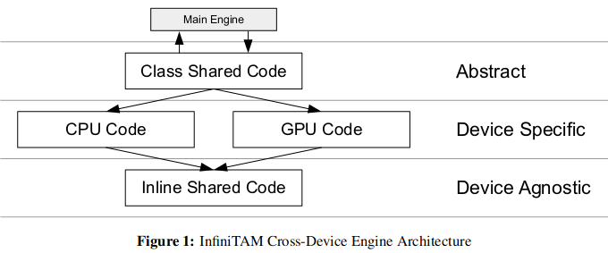

# 代码中的各种概念
- engine：表示各种接口？？？
- view：表示输入图片
- view frustum：视锥，或者叫平截头体
- render：在voxel表示的场景中，就是raycasting。那surfel呢？？？
- voxel size: 每个voxel在真实世界下的边长，单位为米
- block size: block中每一边有几个voxel，默认是8。即一个block中的voxel数量为8\*8\*8
- 真实坐标：其中坐标的单位为真实世界的单位，在InfiniTAM中为“米”
- $\text{voxel坐标 = 真实坐标 / voxel size}$
- $\text{block坐标 = voxel坐标 / block size}$
- ordered entries && unordered entries && excess list：见论文的Fig2，ordered entries就是直接通过哈希值索引找到的entry数组；unordered entries(excess list 或者 overflow list)是为了解决哈希冲突额外设立的entry数组，通过 哈希值找到的ordered entry中的offset来索引。
    - 需要注意的是，ordered + unordered entry的数量 = SDF_BUCKET_NUM，是比device上的voxel block array的长度（=SDF_LOCAL_BLOCK_NUM）长的
- allocate && allocattion：分配空间的意思。voxel hashing对整个空间划分block后没有马上分配空间，而是扫描到东西了后才分配。对于CPU，空间指的是内存；对于GPU，空间指的是显存（当然可能会被转移到内存上）
- device && host: 如果使用了GPU，一般来说device指GPU（或者显存）、host指CPU（或者内存）；如果只用了CPU，一般来说device指内存，host指硬盘，但是代码中device和host都是内存（应该是还没实现完）
- VBA：voxel block array的缩写。
    - 说是block array，其实本质上是个voxel array，通过$i*\text{SDF\_BLOCK\_SIZE3}$即可在VBA中找到每个block的起始位置
    - localVBA（即device上的VBA）的长度为SDF_LOCAL_BLOCK_NUM，是小于hash table中entry的数量的
- voxel点云：点云中的每个三维点是voxel坐标系，乘上voxel size 就可以获得真实点云
- 有序voxel点云：有序点云中的每个三维点是voxel坐标系，乘上voxel size 就可以获得真实的有序点云
# 代码跟论文的区别

| 论文                                                         | 代码                                                       |
| ------------------------------------------------------------ | ---------------------------------------------------------- |
| Fig4中说的顺序是integration => swap in => raycast => swap out | 代码中的顺序是ntegration => swap in => swap out => raycast |
|                                                              |                                                            |
|                                                              |                                                            |

# 注释风格

- 使用[谷歌代码风格](https://zh-google-styleguide.readthedocs.io/en/latest/google-cpp-styleguide/contents/)，但是将行宽改成了120（∵我用的是27寸显示器）

- 每个函数的申明之前会有doxygen的注释，包含函数功能的简介、形参和return的意义。但是如果函数太简单 or 直白，就只会用`/** xxx */`这样的注释表示函数功能

- 函数内部实现的注释包含三个层级

    - 第一层：`//!`开头的注释，表示大步骤
    - 第二层：`//`开头 且 单独一行 的注释，表示小步骤
    - 第三层：跟代码同一行的 `//`的注释，表示对当前行代码的注释（不过有时候也表示小步骤）

- 使用了一些特殊注释符号

    - `// TODO`开头的注释 表示 后续需要再次关注的注释。可能是因为 注释不确定，也可能是因为 存在优化点
    - `// NOTE`开头的注释 表示 理解代码的时候 需要注意的地方

- 使用vscode，并做了如下的一些配置 来让注释更加美观，推荐使用

    - 安装插件[**Better Comments**](https://marketplace.visualstudio.com/items?itemName=aaron-bond.better-comments)，在设置中的`better-comments.tags`加入如下内容，给`// NOTE`添加颜色

        ```json
        {
            "tag": "note",
            "color": "#98C379",
            "strikethrough": false,
            "underline": false,
            "backgroundColor": "transparent",
            "bold": false,
            "italic": false
        },
        ```

    - 安装插件**[Doxygen Documentation Generator](https://marketplace.visualstudio.com/items?itemName=cschlosser.doxdocgen)**，并在设置中的`editor.tokenColorCustomizations`加入如下内容，来[修改doxygen注释颜色](https://blog.csdn.net/weixin_44488341/article/details/130621912)

        ```json
        "textMateRules": [
            {
                "scope" : [
                    "comment.block.documentation.cpp",
                    "storage.type.class.doxygen"
                ],
                "settings": {
                    "foreground": "#689451",
                    "fontStyle": "bold"
                }
            }
        ]
        ```

    - 安装插件[**indent-rainbow**](https://marketplace.visualstudio.com/items?itemName=oderwat.indent-rainbow)，给不同层级的缩进添加颜色

# 命名规则

## 变量

- 采用 小驼峰命名法
- `no`开头的变量：表示数量
- `_local`结尾的变量：表示存放在device上
- `_global`结尾的变量：表示存放在host上

## 文件

- 在ITMLib的Engines中，存放的是各个算法模块（流程）的实现。每一个模块（文件夹）的代码构成方式如下所示

    

    - 首先`Interface`中存放了该模块最基础的 类，其中的成员函数只是用于定义接口，通常使用纯虚函数。对应上图的Abstract
    - 然后根据不同的设备类型（CPU、GPU、Metal），派生 出不同的类，存放在`CPU`、`CUDA`、`Metal`文件夹下。而同一种设备中，也可能会根据不同的功能，实现不同的类（比如Reconstruction中，会区分voxel和surfel的视线）。类中实现具体功能。对应上图的Device Specific
    - 虽然不同设备类型会使用不同的类，但是有些代码是共用的，存放在`Shared`文件夹下。共用的代码通常是处理单个像素、单个voxel之类的函数，在CPU中使用for循环调用，在CUDA中使用核函数调用。这些函数都会加上`_CPU_AND_GPU_CODE_ inline`。对应上图的Device Agnostic
    - 最后，`ITMXXXXXEngineFactory.h`来根据需求（设备类型、功能等）来选择不同的工作模式，通过 父类指针 指向 子类指针 实现。


# 文件夹说明
├── Apps：InfiniTAM的demo程序
│   ├── android
│   ├── InfiniTAM
│   ├── InfiniTAM_cli
│   └── iOS
├── cmake：
├── FernRelocLib：单独将基于随机蕨的重定位算法弄成了一个库
├── Files：存放相机内参文件
│   ├── PrimeSense
│   └── Teddy
├── images：存放用于重建的图像序列。
├── InputSource：输入相关代码。比如从各种RGBD相机读取数据，或者从图片序列、视频流读取数据等
├── ITMLib：**InfiniTAM v3的主要代码**
│   ├── Core：InfiniTAM v3各种运行模式（比如基础模式、surfel模式等）的主体框架
│   ├── Engines：关于“过程”的代码，通过 类 实现。比如对于marching cube算法，如何从三维模型中抽取网格的代码就放在Engines中。其中每个模块里的代码构成见 “[命名规则中的文件](#文件)”
│   │   ├── LowLevel：对输入图片做各种底层的预处理的代码，比如copy、均值滤波、计算梯度等
│   │   ├── Meshing：marching cube相关代码
│   │   ├── MultiScene
│   │   ├── Reconstruction：重建模块。负责维护一个ITMLib::Objects::ITMScene，将输入图像融入场景中。
│   │   ├── Swapping: device端和host端之间的数据交换。对应论文的。有CPU和GPU（CUDA）版本。推荐别看CPU的，因为就是内存的数据从自己拷贝到自己，没意思！GPU版的，会将暂时不可见的数据从显存挪到内存中，从而增加重建范围（这才是swap的意义）
│   │   ├── ViewBuilding：对输入图片做最后预处理，包含深度图的转换、双边滤波、计算法向量和权重 等
│   │   └── Visualisation
│   ├── Objects：关于“对象”的代码，通过 类 实现。比如对于marching cube算法，抽取得到的mesh模型的数据结构放在Objects中
│   │   ├── Camera
│   │   ├── Meshing：三维场景的mesh。
│   │   ├── Misc
│   │   ├── RenderStates
│   │   ├── Scene
│   │   ├── Tracking
│   │   └── Views
│   ├── Trackers
│   └── Utils
├── MiniSlamGraphLib
└── ORUtils

# 注释进度

- [ ] Apps
    - [ ] InfiniTAM
- [ ] FernRelocLib
- [ ] InputSource
- [ ] ITMLib
    - [ ] Core
    - [ ] Engines
        - [x] LowLevel
        - [x] Meshing
        - [ ] MultiScene
        - [x] Reconstruction
        - [x] Swapping
        - [x] ViewBuilding
        - [ ] Visualisation
    - [ ] Objects
        - [ ] Camera
        - [x] Meshing
        - [ ] Misc
        - [ ] RenderStates
        - [ ] Scene
        - [ ] Tracking
        - [ ] Views
    - [ ] Trackers
    - [ ] Utils
- [ ] MiniSlamGraphLib
- [ ] ORUtils